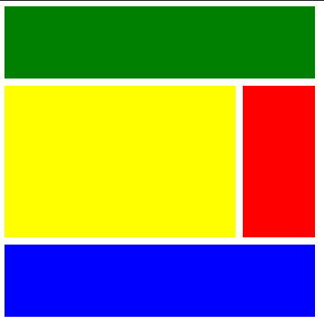

# nc-css-masterclass
노마드 코더 SCSS, CSS Flexbox, CSS Grid 강의 노트 

## CSS flexbox

flexbox 이전에는 반응형 웹사이트를 만들기 어렵다. 사용하는 기기의 화면 크기가 달라지면 디자인이 망가졌기 때문이다.

### 1. flexbox

플렉스박스에서는 children보다는 부모 요소가 중요하다. (직계)부모 요소에 display: flex; 를 지정해놓는다. 

그러면 그 안의 자식 요소들은 정렬된다.

### 2. flex-direction

flex-direction는 main axis를 결정한다. 

row(기본값)와 column이 있다.

row는 가로 정렬 , column 세로 정렬이다.

세로로 정렬하고 싶다면 

#### justify-content

main axis(기준축, row 혹은 column)을 기준으로 요소의 위치 결정

`center`: 가운데 정렬

`space-between`: 요소를 양 끝점에 정렬한 뒤 그 사이 요소들을 동일한 간격으로 정렬

`space-around`: 요소들의 양 옆 공간을 동일하게 하여 정렬

`space-evenly`: 요소들을 동일한 간격으로 정렬


```css
justify-content: center;
```

#### align-items

cross axis(main axis에 수직으로 연하는 축)를 기준으로 요소의 위치 결정

`center`: 가운데 정렬

`stretch`: 전체 높이까지 쭉 뻗는다.

`flex-start`: 아이템을 맨 앞에. 기본값.

`flex-end`: 아이템을 맨 끝에.

등등.

#### flex-direction: column;

```css
flex-direction : column;
```

으로 지정하면 main axis는 수직, 세로가 되고, cross axis는 수평, 가로가 된다.

요소는 main axis를 따라 세로로 정렬된다.

### 1.5 align-self and order

flexbox에서 자식에게 줄 수 있는 요소는 두 가지 뿐이다. align-self와 order

#### align-self

flexbox의 자식요소에 지정

align-items와 비슷하지만 자식요소 개별로 지정 가능

```css
.children:nth-child(2) {
  align-self: center;
}
```

flex-direction: row에서 align을 정상적으로 작동하게 하고 싶으면 parent에 height를 줘야 한다.

#### order

HTML을 건드리지 않고 요소의 순서 변경.

모든 요소의 order의 기본값은 0이다.

```css
.children:nth-child(2) {
  order: 1;
}
```

이런식으로 지정하면 1, 3의 order는 0이기 때문에 두 번째 요소는 마지막에 배치된다.

### 1.6 wrap, nowrap, reverse, align-content

기본적으로 flexbox는 너비가 바뀌는 한이 있더라도 한 줄에 정렬된다.

`flex-wrap` 의 기본값은 `nowrap`

wrap으로 바꾸면 너비는 유지되고 요소들이 다음줄로 넘어간다.

줄과 줄 사이의 간격을 조절하는 방법은 `align-content` 

`align-content`를 flex-start로 하면 줄 간격이 사라진다. `center`는 화면의 가운데

```css
.parent {
  display: flex;
  /* main axis */
  justify-content: space-evenly;
  /* cross axis */
  align-items: flex-start;
  /* flex-wrap */
  flex-wrap: wrap;
  align-content: space-between;
  height: 150vh;
}
```

`flex-flow` 속성은 row wrap, column wrap 과 같이 direction과 한 번에 적용 가능하다.

### 1.7 flex-grow, flex-shrink

flex-grow, flex-shrink은 자식에게 주는 속성

#### flex-shrink

기본값 1. 화면의 크기가 줄어들어 너비가 줄어들을 때, 요소별로 그 너비가 줄어드는 정도를 조절해줄 수 있다.

숫자가 클수록 더 많이 줄어든다.

#### flex-grow

shrink와 비슷하지만 반대의 기능이다.

요소 사이의 빈 공간을 채운다.

기본값은 0.

요소별로 숫자를 지정하면 더 큰 숫자를 지닌 요소가 주변 공간을 더 많이 가져간다.

둘다 반응형 사이트를 만들 때 유용하다.

### 1.8 flex-basis

자식요소에 적용.

어떤 공간이 찌그러지거나 늘어나기전의 크기.

메인축을 기준으로 작동한다. row면 width, column이면 height

많이 쓰이진 않는다.

## CSS grid

### 2.0 Life Before Grid

flexbox 만으로극 격자 무늬를 만들기 어렵다.

### 2.1 CSS Grid Basic Concepts

grid도 기본적으로 부모 요소에서 시작한다.

```css
.parent {
  display: grid;
  /* column의 개수 및 크기 */
  grid-template-columns: 250px 250px 250px;
  /* row의 개수 및 크기 */
  grid-template-rows: 250px 250px 250px;
  /* column의 간격 */
  column-gap: 10px;
  /* row의 간격 */
  row-gap: 10px;
}
```

### 2.2 Grid Template Areas

repeat(개수, 크기) 함수

위와 아래는 같다.
```css
.grid {
  display: grid;
  grid-template-columns: 200px 200px 200px 200px;
}
```

```css
.grid {
  display: grid;
  grid-template-columns: repeat(4, 200px);
}
```

```css
.grid {
  display: grid;
  grid-template-columns: repeat(4, 200px);
  grid-template-rows: repeat(4, 200px);
  /* 콤마를 쓰지 않는다. */
  grid-template-areas:
    "header header header header"
    "content content content nav"
    "content content content nav"
    "footer footer footer footer";
}

.header {
  background: green;
  /* string으로 적지 않는다. */
  grid-area: header;
}

.content {
  background: yellow;
  grid-area: content;
}

.nav {
  background: red;
  grid-area: nav;
}

.footer {
  background: blue;
  grid-area: footer;
}
```

지정한 영역대로 css가 적용된다.

### 2.3 Rows and Columns



숫자는 컬럼이나 로우가 아니라 grid의 선이다.

즉, 1칸을 선택하려면 start는 1, end는 2가 되어야 한다.

```css
.grid {
  display: grid;
  gap: 10px;
  grid-template-columns: repeat(4, 100px);
  grid-template-rows: repeat(4, 100px);
}

.header {
  background: green;
  /* 컬럼이 아니라 line */
  /* grid에 그어진 줄을 1번부터 센다. 아래 코드는 네 칸을 차지한다. */
  grid-column-start: 1;
  grid-column-end: 5;
}
.content {
  background: yellow;
  grid-column-start: 1;
  grid-column-end: 4;
  grid-row-start: 2;
  grid-row-end: 4;
}

.nav {
  background: red;
  grid-row-start: 2;
  grid-row-end: 4;
}

.footer {
  background: blue;
  grid-column-start: 1;
  grid-column-end: 5;
}

```

### 2.4 Shortcuts

grid start, end를 한 번에 처리할 수 있다.

```css
.grid {
  display: grid;
  gap: 10px;
  grid-template-columns: repeat(4, 100px);
  grid-template-rows: repeat(4, 100px);
}

.header {
  background: green;
  /* 컬럼이 아니라 line */
  /* start 1, end 5 */
  grid-column: 1 / 5;
}
.content {
  background: yellow;
  grid-column: 1 / 4;
  grid-row: 2 / 4;
}

.nav {
  background: red;
  grid-row: 2 / 4;
}

.footer {
  background: blue;
  grid-column: 1 / 5;
}
```

line수를 직접 세는 것보다 시작, 마지막 이런 식으로 적는 게 낫다.

즉, line이 몇 개가 생길지는 모르지만, 마지막, 혹은 마지막 전까지 생성하고 싶다. 그러면 -1, -2 등으로 쓴다.

```css
.grid {
  display: grid;
  gap: 10px;
  grid-template-columns: repeat(4, 100px);
  grid-template-rows: repeat(4, 100px);
}

.header {
  background: green;
  /* 컬럼이 아니라 line */
  /* grid에 그어진 줄을 1번부터 센다. 아래 코드는 네 칸을 차지한다. */
  /* -1은 마지막 줄, -2는 마지막 그 다음 */
  grid-column: 1 / -1;
}
.content {
  background: yellow;
  grid-column: 1 / -2;
  grid-row: 2 / -2;
}

.nav {
  background: red;
  grid-row: 2 / 4;
}

.footer {
  background: blue;
  grid-column: 1 / 5;
}
```

line이 아니라 칸 숫자로 하고 싶으면 span을 사용한다.
```css
.header {
  background: green;
  /* 컬럼이 아니라 line */
  /* span은 줄이 아니라 칸 수. 음수는 안 된다. */
  grid-column: span 4;
}
/* span을 사용할 때 시작점이 필요하면 지정할 수 있다. */
.content {
  background: yellow;
  grid-column: span 3;
  grid-row: 2 / span 2;
}
```

### 2.5 Line Naming

line에 이름을 붙여서 사용할 수도 있다.

```css
.grid {
  grid-template-columns:
    [first] 100px [second] 100px [third] 100px
    [fourth] 100px [fifth];
  grid-column: first / fourth;
}
```

### 2.6 Grid Template

fraction은 사용 가능한 공간. 

repeat(4, 1fr) 

이라고 하면 내가 설정한 grid의 width 내에서 4번 반복할 수 있는 크기고 나뉜다.

fr은 비율이다. 

화면 크기에 맞춰 자동 조절되기 때문에 반응형 웹페이지를 만들 때 유용하다.

```css
.grid {
  display: grid;
  gap: 10px;
  width: 80vw;
  height: 50vh;
  grid-template-columns: repeat(4, 1fr);
  grid-template-rows: repeat(4, 1fr);
}
```

grid-template 사용하기

```css
.grid {
  display: grid;
  gap: 5px;
  height: 50vh;
  grid-template:
    /* "area" row의 길이 / 각 column의 길이  */
    "header header header header" 1fr
    "content content content nav" 2fr
    "footer footer footer footer" 1fr / 1fr 1fr 1fr 1fr;
}
```

### 2.7 Place Items

grid 컨테이너가 grid를 갖고 있고

justify-items의 기본 값은 stretch

justify-items은 수평

align-items는 수직. 기본값은 역시 stretch

stretch면 해당 grid를 가닥 채운다ㅏ.
```css
.grid {
  display: grid;
  gap: 5px;
  height: 50vh;
  grid-template-columns: repeat(4, 1fr);
  grid-template-rows: repeat(4, 1fr);
  justify-items: stretch;
}
```

start, center, end 등으로 위치를 이동시킬 수 있다.

place-items: 수직 수평

을 사용하면 한 번에 할 수 있다.

```css
.grid {
  display: grid;
  justify-items: center;
  align-items: center;
}
```

```css
.grid {
  display: grid;
  place-items: center center;
}
```
### 2.9 Place content

items: grid의 cell 하나하나

content: grid 전체

justify-content의 기본값은 start

```css
.grid {
  justify-content: start;
}
```

space-around 등도 가능하다

align-content도 그렇다.

justify-content는 수평, align-content는 수직. 

```css
.grid {
  align-content: space-around;
}
```

place-content도 가능하다. 수직 수평 순

```css
.grid {
  align-content: center;
  justify-content: center;
  place-content: center center;
}
```

### 2.10 Auto Columns and Rows

align-self는 자식 요소에게 설정한다.

justify-self도 마찬가지다.
```css
.header {
  align-self: end;
  justify-self: end;
  /* 수직, 수평 */
  place-self: end center;
}
```

auto-rows, auto-column
```css
.grid {
  display: grid;
  gap: 5px;
  grid-template-columns: repeat(4, 100px);
  grid-template-rows: repeat(4, 100px);
}
```

위처럼 설정하면 4개의 행, 열만 커버 가능하다.

grid-auto-columns 혹은 grid-auto-rows를 사용하면 데이터베이스에서 가져오는 요소에 맞춰서 행과 열을 생성

```css
.grid {
  display: grid;
  gap: 5px;
  grid-template-columns: repeat(4, 100px);
  grid-auto-rows: 100px;
}
```

```css
.grid {
  display: grid;
  gap: 5px;
  grid-template-columns: repeat(4, 100px);
  grid-template-rows: repeat(4, 100px);
  grid-auto-flow: column;
}
```

그리드가 자동생성되는 방향을 바꾸고 싶다면 

grid-auto-flow를 사용한다. default는 row이다.

### 2.11 minmax

요소가 가능한 커지길 바라지만 최소 크기를 갖길 원할 때 사용

```css
.grid {
  display: grid;
  gap: 5px;
  grid-template-columns: repeat(10, 1fr);
  grid-template-rows: repeat(4, 100px);
  grid-auto-columns: 100px;
}
```

위의 코드에서 1fr은 화면의 크기에 따라 크기가 달라진다.

화면이 작아져도 박스의 크기를 일정이상 유지하고 싶을 때 minmax()를 사용한다.

```css
.grid {
  display: grid;
  gap: 5px;
  /* minmax(최소, 최대) */
  grid-template-columns: repeat(10, minmax(100px, 1fr));
  grid-template-rows: repeat(4, 100px);
  grid-auto-columns: 100px;
}
```

### 2.12 auto-fit auto-fill

반응형 웹을 만들 떄 필요하다.

```css
.grid:first-child {
  grid-template-columns: repeat(auto-fill, minmax(100px, 1fr));
}

.grid:last-child {
  grid-template-columns: repeat(auto-fit, minmax(100px, 1fr));
}
```

auto-fill

우리가 준 사이즈 안에서 최대한 많은 column을 생성한다.

auto-fit

현재 row에 있는 요소들을 화면에 맞춰 크기를 조절한다. 

화면을 키우면 auto-fill을 한 요소는 빈 컬럼이 늘어나고

auto-fit한 요소는 빈 컬럼이 아니라 요소들의 크기가 화면에 맞춰 늘어난다.

### 2.13 min-content max-content

max-content

박스가 content 크기만큼 커진다.

min-content

박스가 작아질 수 있을만큼 작아진다.

```css
.grid {
  grid-template-columns: max-content min-content;
}
```

minmax와 활용해서 최소값을 max-content, 최대값을 원하는 값으로 하면 좋다.

### 3.0 CSS Preprocessors and Set Up

SCSS 

CSS 전처리기. 

SCSS를 compile 해서 CSS 파일로 만든다.

CSS를 프로그래밍 언어처럼 사용할 수 있다. 변수나 함수 등을 사용할 수 있다.

compile과 build가 필요하다. 

### 3.1 Variables and Nesting

gulp는 src 내 styles.scss 파일을 보고 있다.

이 scss 파일이 complile 되면 dist 폴더 내의 css 파일로 변환된다.

variables

SCSS 는 변수를 사용하여 CSS를 제어할 수 있다.

가장 중요하거나 반복되는 요소를 저장해서 사용한다. 

scss 파일을 `_variables.scss` 처럼 언더바를 앞에 붙이면 css로 컴파일 되지 않는다. 

변수를 저장해둘 파일을 따로 만든다. 

**_variables.scss**

```scss
// $를 이용해서 변수 생성
$bg: #e74c3c;
```

해당 파일을 import 한다.

**styles.scss**

```scss
// 변수 파일 import
@import "_variables";

body {
  background: $bg;
}
```

**nesting**

```scss
.box {
  margin-top: 20px;
}

.box h2 {
  color: blue;
}

.box:hover {
  background-color: green;
}
```

이런 식의 코드를

```scss
.box {
  margin-top: 20px;

  h2 {
    color: blue;
  }

  &:hover {
    background-color: green;
  }
}
```

이렇게 작성할 수 있다.

**&**은 자기 자신을 뜻한다.

### 3.2 Mixins

상황에 따라 다르게 코딩을 하고 싶으면 사용한다.

scss 구문 덩어리를 재사용하는 것

**_mixins.scss** 파일을 만들고 아래 구문을 작성한다. 

```scss
@mixin sexyTitle {
  color: blue;
  font-size: 30px;
  margin-bottom: 10px;
}
```

**styles.scss**

```scss
@import "_mixins";

h2 {
  @include sexyTitle();
}
```

mixins 파일을 import. mixin을 사용할 때 @include 어노테이션 사용. 함수를 실행하듯 ()로 로드.

변수 또한 사용 가능하다.

mixin을 만들 때는 **@mixin** 사용할 때는 **@include**

#### mixins.scss

```scss
@mixin link($color) {
  text-decoration: none;
  display: block;
  color: $color;
}
```

#### styles.scss

```scss
a {
  margin-bottom: 10px;
  &:nth-child(odd) {
    @include link(blue);
  }

  &:nth-child(even) {
    @include link(red);
  }
}
```

**if - else** 문도 가능하다.

#### mixins.scss

```scss
@mixin link($word) {
  text-decoration: none;
  display: block;
  @if $word == "odd" {
    color: purple;
  } @else {
    color: yellow;
  }
}
```

#### styles.scss

```scss
a {
  margin-bottom: 10px;
  &:nth-child(odd) {
    @include link("odd");
  }

  &:nth-child(even) {
    @include link("even");
  }
}
```

### 3.3 Extends

같은 코드를 중복해서 사용하고 싶지 않을 때 사용한다.

페이지에서 분리해야 하는 요소들이 많을 때 유용하다. 버튼, 타이틀, 카드, 네비게이션 등

익스텐드로 사용할 것을 선언할 때는 **%**를 사용하고, 그 설정을 사용할 때는 **@extend** 어노테이션을 사용한다.

#### _button.scss

```scss
// extend 사용하기 "%"
%button {
  font-family: inherit;
  border-radius: 7px;
  font-size: 12px;
  text-transform: uppercase;
  padding: 5px 10px;
  background: peru;
  color: white;
  font-weight: 500;
}
```

#### styles.scss

```scss
@import "_button";

a {
  // extend 요소 사용하기.
  @extend %button;
  // 공통된 프로퍼티는 extend로 처리하고 별도로 처리해줄 건 따로 작성해준다.
  text-decoration: none;
}

button {
  @extend %button;
  border: none;
}
```